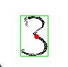
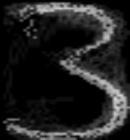
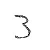

# Number detection
This project is an experiment to detect handwritten digits without using neural
networks.

## working principles
### creating the mask
A mask is created by taking the pixel mean value of each training image. However, before doing that I had to overcome the first problem. In fact if we want to calculate the mean value of each pixel, the digit have to be centered and of the same size. In order to do that I calculated the center of gravity of the image, where the grayscale value of each pixel could be seen as the mass value from 0 (no mass) to 255 (full weight). Afterward the digit gets cropped.

The pictures below shows the digit mask (left), where each pixel is the mean value of the trainig images (right)

### detecting the digit
After centering, cropping and resizing the image of the handwritten digit to detect, each pixel is compared with each pixel of the masks of the digits. A counter is increased by a value, which increase the more the grayscale values of the compared pixels are similar and decreased under a certain value (e.g. pixel of the digit = 255 and the pixel of the mask = 124, then the counter is increased by 3, if the pixel of the mask = 23, then the counter is decreasd by 4).

The digit of the mask with the highest score is more likely to be the handwritten digit to detect.

### problems
The algorithm still not works perfectly, especially by numbers like "1", because you could write it with just a vertical line.
It also doesn't work if the digit is tilted.