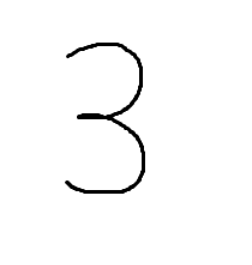

# Number detection
This project is an experiment to detect handwritten digits without using neural
networks.

## working principles
A mask is created by taking the pixel mean value of each training image. However, before doing that I had to overcome the first problem. In fact if we want to calculate the mean value of each pixel, the digit have to be centered and of the same size. In order to do that I calculated the center of gravity of the image, where the grayscale value of each pixel could be seen as the mass value from 0 (no mass) to 255 (full weight). Afterward the digit gets cropped.

The pictures below shows the digit mask (left), where each pixel is the mean value of the trainig images (right)

The pictures below shows the digit mask (left), where each pixel is the mean value of the trainig images (right)

